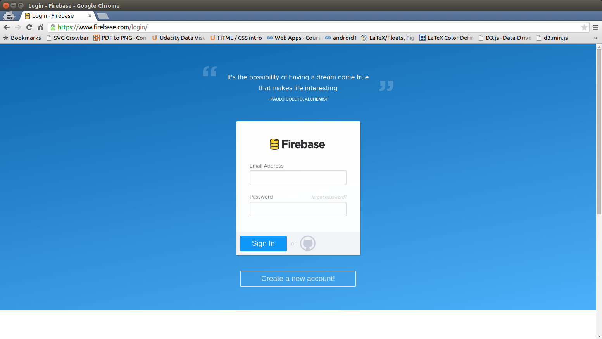

Cucumber is a minimalist commenting system. It is still in the works...  As of today (27 May, 2015), users can login via Facebook, Google, or Github, and leave, edit and remove comments. It's open source so you can modify features as needed. Cucumber uses Firebase to store data. For users who have not used Firebase before, I have posted a tutorial to teach you how to set up your own cucumber-firebase commenting system. Eventually, I would love to add inline commenting, like, flag, reply, notification, as well as image / video posting capabilities.

While there are other (more developed) commenting systems like Disqus, I wanted something more minimalist and malleable. I also feel that users should be able to comment using the common social media apps already existing.

Feel free to leave me a comment...

***

# Tutorial
To use cucumber, you will first need (1) a Firebase account, and (2) Facebook / Google / Github apps. Then, all you need to do is reference the relevant javascript and css files. I will walk you through the set-up of the firebase account and google app, and direct you to a github repository for a simple demo.

## Firebase Account
If you don't already have one, you should first set up a [firebase account](https://www.firebase.com/login/). Firebase is a realtime database that allows users to easily authenticate through Facebook, Google, Github, Twitter, or email and password.

