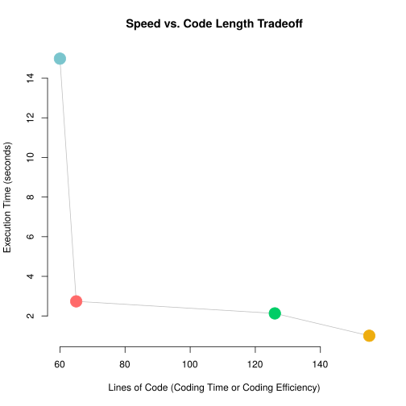

Having used R for 3 years in college, I've gotten to know the limits and
conveniences of R. As a statistical package, with a large support community it
serves its purpose well. However, at times, especially when doing more
computation-heavy analysis, R slows down, and reaches memory limits. Hence,
I've been looking around for a language that is reasonalbly fast, and quick to
develop. Conciseness means less room for coding error (kind of) and usually
higher productivity. I checked out C, C++, Go, Scala, and Julia. And since my
computational work is usually Bayesian, I created my own criteria for judging
performance — a standard Bayesian multiple linear regression algorithm.

\\[\begin{array}{rcl}
   y|\beta & \sim & Normal(X\beta,\sigma^2I) \\\\
     \beta & \sim & Normal(0,100(X'X)^{-1}) \\\\
  \sigma^2 & \sim & Gamma(1,1) \\\\
\end{array}\\]

The simulated data used for this study can be found at my
[github](https://github.com/luiarthur/progSpeedCompare/blob/master/data/dat.txt).

So, I wasn't ever able to successfully implement this algorithm in C or Go. The
linear algebra libraries were just a pain to grind through... But I did code up
the algorithm in R, Julia, C++, and Scala. Ya, so I'm not a coding master. And
there are sites like [computer language benchmark
games](http://benchmarksgame.alioth.debian.org/u64q/compare.php?lang=scala&lang2=gpp)
that do a more thourough job. But, it's sometimes nice to try things yourself!

## Results
From the plots below, we can see that Julia seems to be fast and concise. So, I
guess I'll spend more time with Julia? Totally depends. I definitely found some
things that were non-intuitive. Loading libraries takes a while, but there are
work-arounds that I want to blog about when I get to it.

I've included the code at the bottom of this page so you can check out what I
coded.

C++ wins in execution time.
***

R wins marginally in conciseness.
***

We want things to be in the bottom left quadrant &mdash;  Julia wins that one.
***

## Sample Code

  <button type="button" class="r btn btn-default">R</button>
  <button type="button" class="j btn btn-default">Julia</button>
  <button type="button" class="s btn btn-default">Scala</button>
  <button type="button" class="c btn btn-default">C++</button>

<pre style="padding:0"><code class="R">
dat <- as.matrix(read.table("../data/dat.txt"))
y <- dat[,1]
X <- dat[,-1]
k <- ncol(X)
n <- length(y)
colnames(X) <- paste0("b",0:9)
Xt <- t(X)
XXi <- solve(Xt%*%X)
s <- 100
XXi%*%Xt%*%y
a <- 1
b <- 1
B <- 1e5
s2 <- 10

det <- function(x,log=F) as.numeric(determinant(x,log=log))[1]
ll <- function(be,sig2) t(y-X%*%be)%*%(y-X%*%be)/(-2*sig2) - n/2*log(sig2)
lpb <- function(be) -t(be)%*%XXi%*%be/(s2*2)
lps <- function(sig2) (a-1)*log(sig2)-sig2/b
mvrnorm <- function(M,S,n=nrow(S)) M + t(chol(S)) %*% rnorm(n)

csb <- 4*XXi
css <- 1
acc.b <- 0
acc.s <- 0

b.hat <- matrix(0,B,k)
s2.hat <- rep(1,B)

r.time <- system.time(
for (i in 2:B) {
  b.hat[i,] <- b.hat[i-1,]
  s2.hat[i] <- s2.hat[i-1]

  # Update Beta
  cand <- mvrnorm(b.hat[i,],csb)
  q <- ll(cand,s2.hat[i])+lpb(cand)-ll(b.hat[i,],s2.hat[i])-lpb(b.hat[i,])
  if (q>log(runif(1))) {
    b.hat[i,] <- cand
    acc.b <- acc.b+1
  }

  # Update s2
  cand <- rnorm(1,s2.hat[i],css)
  if (cand>0) {
    q <- ll(b.hat[i,],cand)+lps(cand)-ll(b.hat[i,],s2.hat[i])-lps(s2.hat[i])
    if (q>log(runif(1))) {
      s2.hat[i] <- cand
      acc.s <- acc.s+1
    }
  }

  cat(paste0("\r",round(100*i/B),"%"))
}
)
</code></pre>

